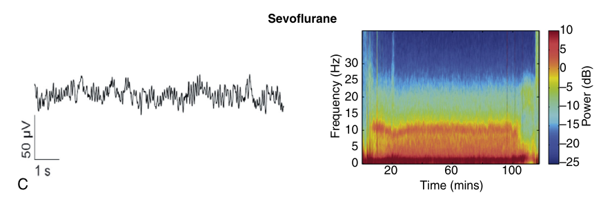

alias:: EEG

- o EEG mostra alterações típicas com o aumento da profundidade anestésica
	- diminuição da frequência das ondas
	- aumento da amplitude das ondas
	- com 3 excepções
		- [[ketamine]]
			- The dissociative anesthetic state produced by ketamine is associated with prominent high-frequency oscillations rather than slow wave oscillations
			- As a consequence, patients can be unconscious with ketamine but have high index values
		- [[nitrous oxide]]
			- The effect of nitrous oxide on the BIS index is ambiguous.
			- Most recent studies state that nitrous oxide increases the amplitude of high-frequency EEG activity and decreases the amplitude of low-frequency EEG activity, yet it has little to no effect on the BIS index.
			- However, these studies have not taken into account the state of profound transient large-amplitude slow oscillations, followed by lower amplitude gamma oscillations that have now been documented to be common features observed when nitrous oxide is administered in high-dose (>50%).
		- [[dexmedetomidine]]
			- In the case of dexmedetomidine, slow oscillations and an appreciable decrease in beta oscillation power are prominent during sedation
			- These dynamics most likely lead to BIS values that are typically in the unconscious range, even
			  though the patient can be aroused by verbal commands or light shaking.
- a nomenclatura das ondas tem a ver com a sua frequência
	- [[spectral frequency bands]]
- o EEG de [[sevoflurane]] é semelhante ao do propofol
	- tem a diferença de adicionar onda theta
	- 
-