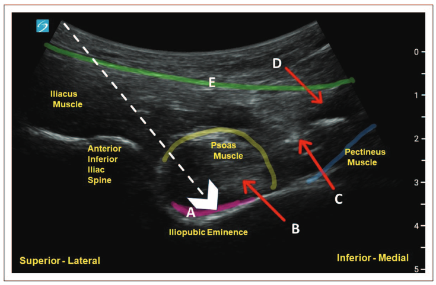

category:: journal-paper
author:: [[Renuka George]]

- 
- associação entre [[frailty]] antes da fractura e do [[postperative delirium]] e a morbilidade e mortalidade
- defende o uso do [[PENG block]]
	- reduzir o nivel da dor e do uso de opioides e poupar a força motora do quadriceps
		- nao atinge o n fem
	- #picture #[[PENG block]]
		- 
- # pontos principais
	- ((65dc55c2-1efa-43b3-84ad-ab17369ba885))
	- ((65dc55dc-4803-4861-bf01-36ed4ec4071a))
	-
- # conceitos
	- [[hip fragility fracture]]
	-