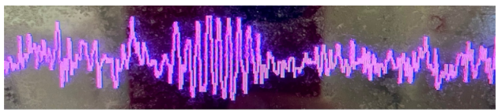

category:: journal-paper
subject:: [[TCI]] [[dexmedetomidine]] [[NORA]]

- 
- #EEG-signature da dexmedetomina
	- dominant alpha activity
		- evitar delta e lenta
	- short, regular spindles
		- semelhante a um sleep spindle
			- simétrico
			- 
- fala do modelo Hannivoort e Collins
-