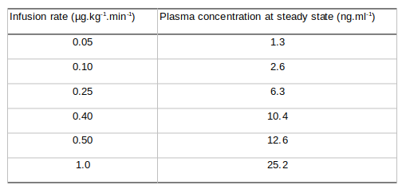

- ((65ce406e-0139-49c9-a6e2-6786928cbff5))
	- is a validated model for [[remifentanil]]
	- can be used for plasma or effect-site targeted TCI
	- age > 12
	- weight > 30 kg
- covariates
	- [[age]]
	- [[weight]]
	- [[height]]
	- [[gender]]
- ((65ce40d3-769c-4bf1-bd22-260122050661))
- Remifentanil plasma concentrations (ng.ml-1) achieved at steady state, estimated by the Minto model in a 70 kg, 170 cm, 40-yr old male patient for various fixed infusion rates.
	- In older patients, the plasma concentration resulting from a given infusion rate is higher, whilst in children it is lower.
	- 
-