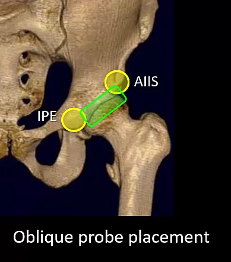
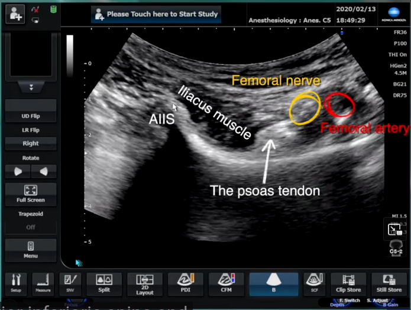
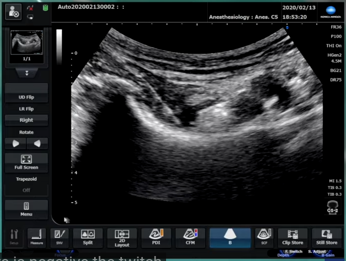

category:: [[regional anesthesia]] [[lower limb]]
alias:: hip block

- pericapsular nerve group block PENG
- usar a [[curvilinear probe]]
	- pode-se usar a linear se o doente for magro
- usar [[regional anesthesia needle 80mm]]
- começar por id a [[femoral crease]] e a [[ASIS]]
- colocar a sonda na prega femoral
	- localizar a [[arteria femural]] e o [[nervo femural]]
	- sonda com profunidade 5 cm
	- identificar a [[hip capsule]]
		- o [[musculo iliaco]] esta superficial à capsula
		- e superficial ao musuculo esta a [[fascia iliaca]]
	- depois ir em direçao craniana
		- perde-se a visao a capsula
		- vê-se o ramo do iliaco - o [[iliopubic ramus]]
			- medialmente vê-se a [[ilio-pubic eminence]]
		- rodar a sonda de forma a ver simultaneamente
			- {:height 448, :width 389}
			- a art femural e o n femural
			- o ramo do iliaco
			- a [[AIIS]] o [[musculo iliaco]] o [[tendao do psoas]]
			- 
- o objetivo é colocar a ponta da agulha junto ao ramo do iliaco e injetar AL no plano entre o musc iliaco e o osso lat ao tendao do psoas
	- angulo mto verticalizado
	- in-plane
	- 
- usar [[nerve stimulator]] para saber que nao estamos no n femural
- #indication #analgesia #hip-replacement
	- bloqueia a parte ant da capsula da anca
		- [[nervo femural]]
		- [[nervo obturador]]
		- [[nervo obturador acessório]]
- #local-anesthetic volume 20 mL
	- 0.375% [[ropivacaine]]
-
-
- # videos
	- <iframe width="560" height="315" src="https://www.youtube.com/embed/n_esn8lMxKw?si=Z-oDcD0EWDFGtmx6" title="YouTube video player" frameborder="0" allow="accelerometer; autoplay; clipboard-write; encrypted-media; gyroscope; picture-in-picture; web-share" allowfullscreen></iframe>
	- <iframe width="560" height="315" src="https://www.youtube.com/embed/io1VKWMADDo?si=1hZq1e2-X2jFlCtZ" title="YouTube video player" frameborder="0" allow="accelerometer; autoplay; clipboard-write; encrypted-media; gyroscope; picture-in-picture; web-share" allowfullscreen></iframe>
-