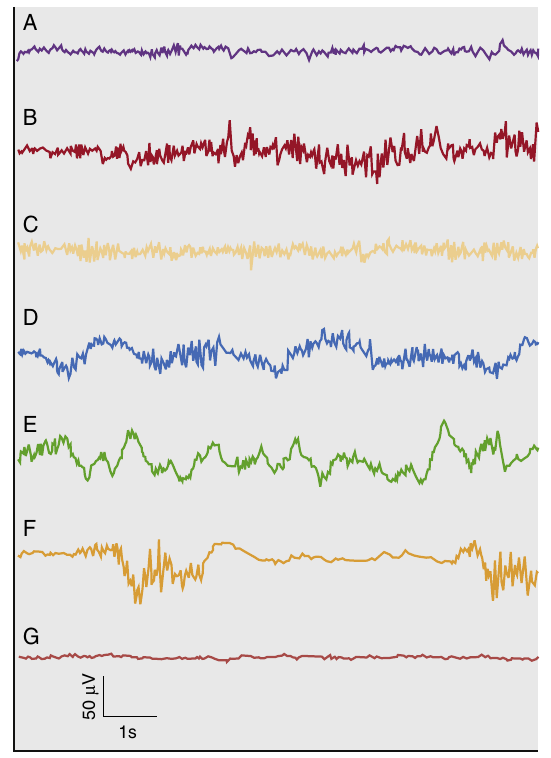
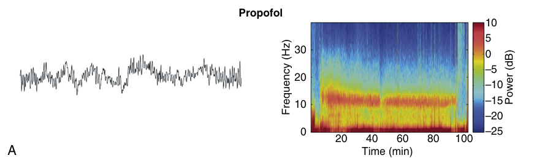

subject:: [[propofol]] [[anesthetic state]] [[EEG signature]]

- tirado do [[Miller's anesthesia 9th ed 2019]]
	- 
	- A padrão acordado
		- com olhos abertos
	- B excitação paradoxal
	- C beta oscillations
		- 13-25 Hz
		- associado a um estado despertável de sedação
	- D oscilações
		- lentas 0.1-1 Hz
		- delta 1-4 Hz
		- alpha 8-12 Hz
		- associadas a um estado profundo de anestesia cirúrgica
	- E oscilações lentas
		- durante indução com propofol
		- durante sedação profunda com dexmedetomidina
	- F burst supression
		- anestesia nos idosos
		- coma induzido por anestésicos
		- hipotermia
	- G isoelétrico
		- curtos períodos em anestesia profunda
		- coma induzido por anestésicos
		- hipotermia profunda
- The EEG patterns of propofol have been related to its neural circuit mechanisms. The brain states under propofol are readily visible in the unprocessed EEG and the spectrogram
	- Propofol acts primarily at GABAA receptors throughout the brain and spinal cord to enhance inhibition in neural circuits
- When patients are unconscious from propofol, the EEG shows a characteristic alpha (8-12 Hz) oscillation pattern along with slow (0.1-1 Hz) and delta (1-4 Hz) oscillation patterns
	- 
	-
- Another phenomenon that is observed in patients who are unconscious from propofol and several
  other anesthetics is [[anteriorization]]
	- the increase in power in the alpha and beta frequency ranges during unconsciousness across the front of the scalp relative to other areas of the scalp
-