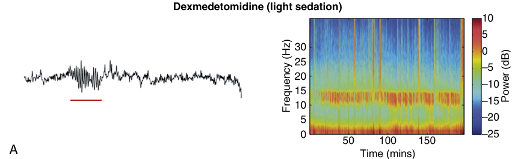
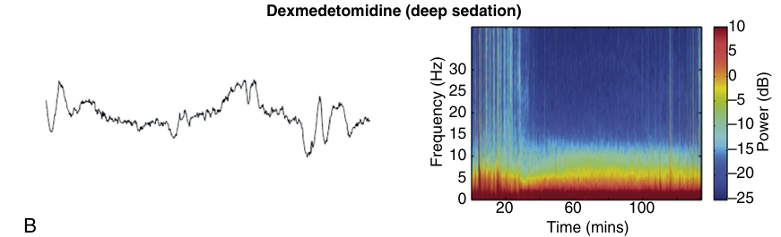

category:: anesthetic-drug

- padrão de EEG varia com a profundidade da sedação
	- [[light sedation]]
		- 
		- spindle oscillations 9-15 Hz
		- slow and delta oscillations
		- similar to NREM stage 2 sleep
	- [[deep sedation]]
		- 
		- absence of spindles
		- predominance of slow and delta waves
		- similar to NREM stage 3 sleep
			- slow-wave sleep
-