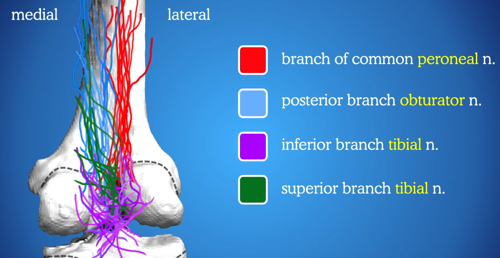
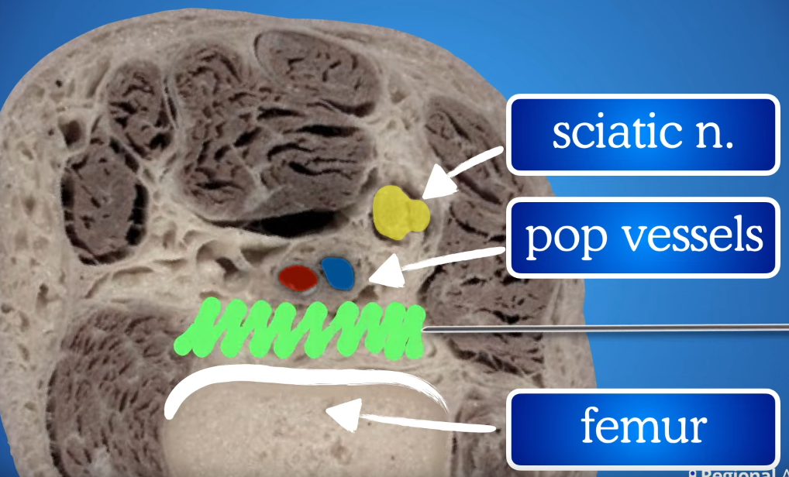

category:: video [[regional anesthesia]] [[iPack]]

- <iframe width="560" height="315" src="https://www.youtube.com/embed/k3JHNIlW9u4?si=hi9-H0mkH9rxfAQt" title="YouTube video player" frameborder="0" allow="accelerometer; autoplay; clipboard-write; encrypted-media; gyroscope; picture-in-picture; web-share" allowfullscreen></iframe>
- alivia a dor posterior do joelho
- bloqueia o [[popliteal plexus]]
	- 
- injetar AL entre os vasos popliteos e a parte pos do femur
	- 
- pode ser feito supino com a perna elevada
- pode ser feito em decub lat
- colocar a sonda na fossa poplitea
	- se estiver distal vê-se os 2 condilos femurais
		- nesse caso, ir para mais prox
- usado para [[TKA]]
- usar volume 20 mL de AL diluido
	- p ex ropi 0.2
- a [[curvilinear probe]] ajuda a ver todo o campo a injectar
-