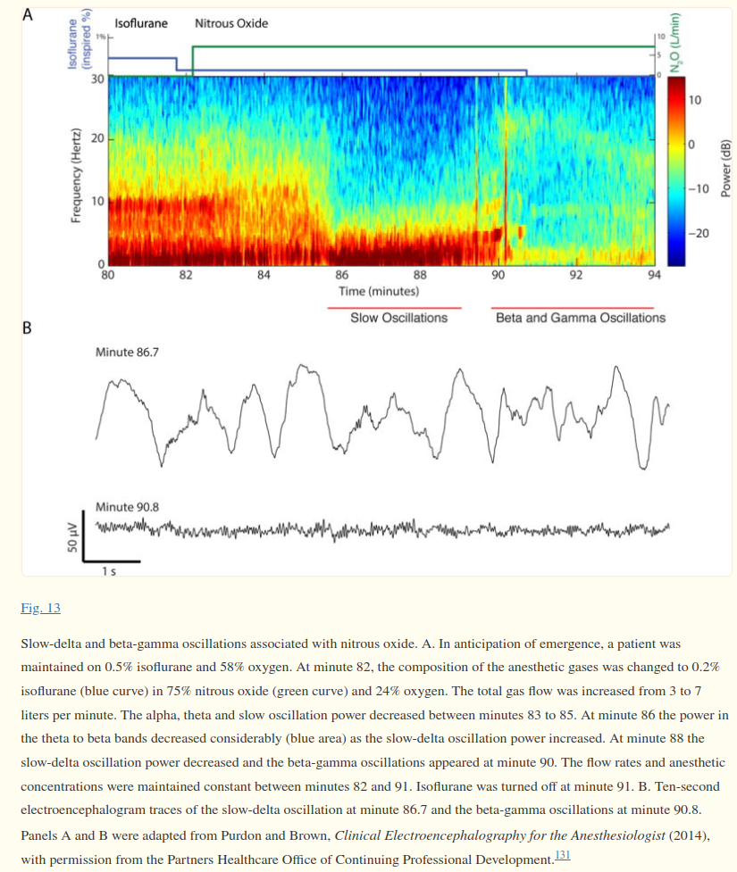

category:: anesthetic-drug
alias:: N2O

- quando usado em  Fi > 50% altera o [[EEG]]
	- não sei se altera ou não o valor do BIS
	- o que acontece é
		- fase inicial transiente de aumento da amplite das slow  e delta oscillations com diminuição das alpha
			- quando iniciado em cima de um halogenado
		- seguida de uma fase de aparecimento de gamma e beta oscillations e diminuição das slow e delta
			- se usado sem halogenado
		- exemplo com isoflurano
			- 
-