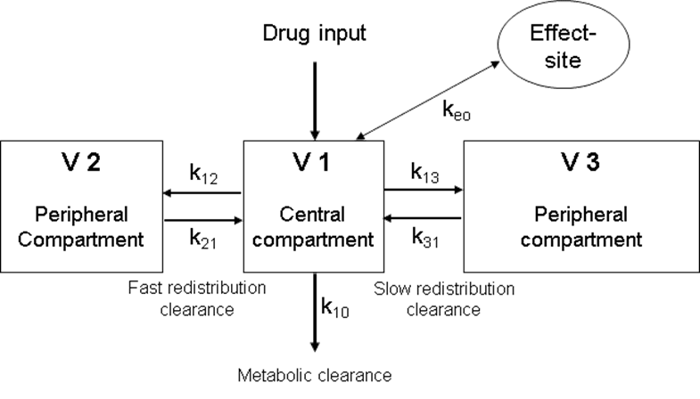

- ((65ce3272-8088-4447-ae95-ce2df779e814))
- it is a mathematical description
	- of the distribution, metabolism and elimination of a drug in the body
- ((65ce32b7-4f5f-43ce-b7ed-7c3f005e5bca))
	- the prediction involves a [[three-compartment model]]
		- Schematic illustration of a three-compartment model
			- with an added [[effect-site compartment]] .
			- Constants k xx represent the proportion of drug that diffuses from one compartment into another, per unit of time.
			- 
- both [[Marsh model]] and [[Schnider model]]
	- ((65ce3929-dde0-4875-8d9e-562625d2c779))
- # references
	- [[manual infusion of propofol]]
	- [[manual infusion of remifentanil]]
	-
	-