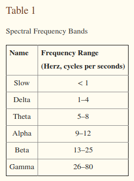

category:: [[EEG]]

- 
- [[slow oscillations]] <1 Hz
- [[delta oscillations]] 1-4 Hz
- [[theta oscillations]] 5-8 Hz
- [[alpha oscillations]] 9-12Hz
- [[beta oscillations]] 13-25 Hz
- [[gamma oscillations]] 26-80 Hz
-